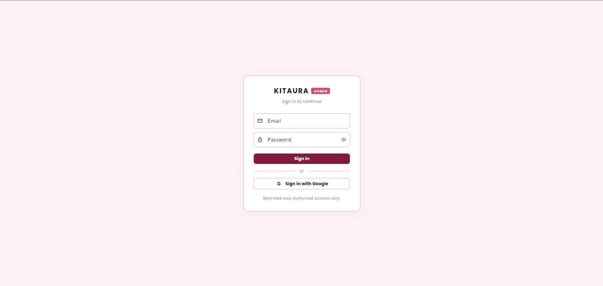
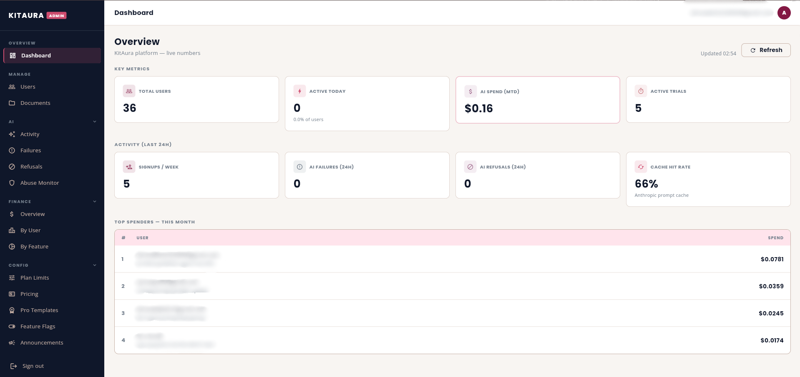
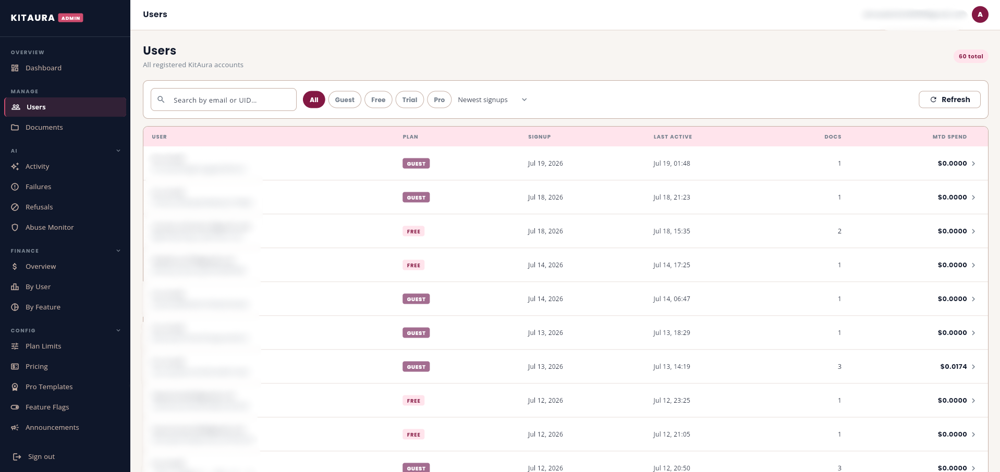
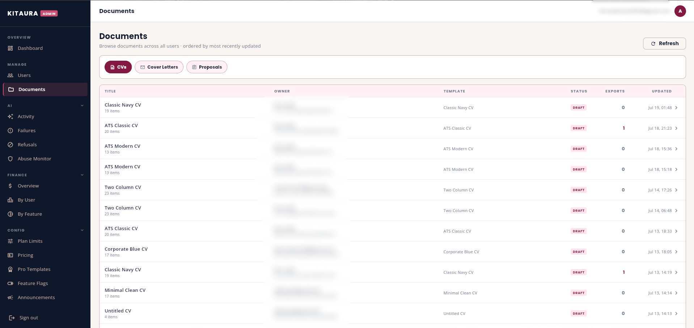
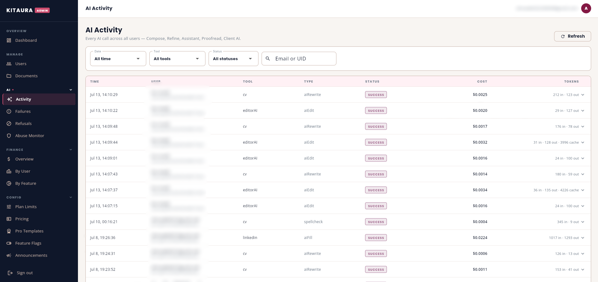
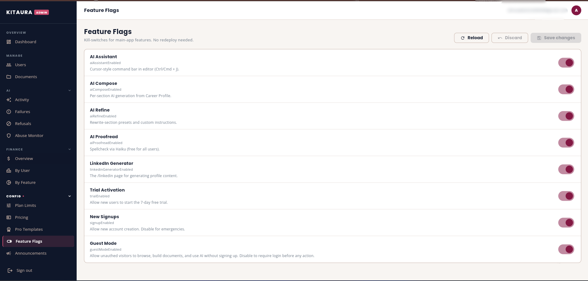
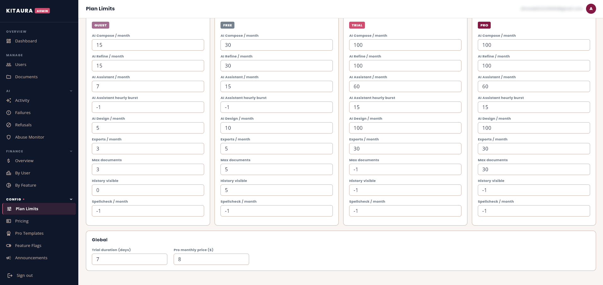
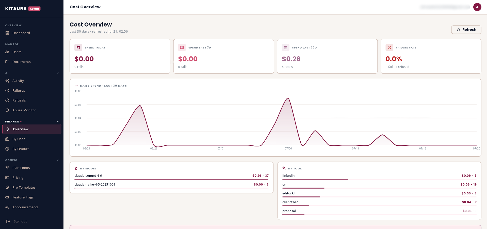

# KitAura Admin

Flutter Web admin panel for the [KitAura](https://github.com/Ahmad-Ali-121/KitAura)
SaaS platform — user management, AI cost tracking, subscription config,
feature flags, and audit logging. Shares the same Firebase backend as the
main KitAura app.


---

## What it does

A restricted Flutter Web panel for KitAura administrators. Gives visibility
into platform health, user behaviour, and AI spend — and lets admins update
subscription limits, feature flags, and announcements without redeploying.

---

## Screenshots

### Login


### Dashboard

*Live metrics — total users, active today, AI spend (MTD), active trials,
signups per week, AI failures, refusals, and Anthropic prompt cache hit rate*

### User Management

*All registered accounts filterable by plan (Guest / Free / Trial / Pro)*

### Documents

*Browse all CVs, cover letters, and proposals across all users*

### AI Activity

*Every AI call — tool, type, status, cost, token count*

### Feature Flags

*Kill-switches for every AI feature — no redeploy needed*

### Plan Limits

*Live caps per plan tier — editable without redeploying*

### Cost Overview

*Daily AI spend by model and feature over the last 30 days*

---

## Features

**Overview**
- Live platform metrics — total users, active today, AI spend MTD,
  active trials, signups per week
- AI health indicators — failure count, refusal count, cache hit rate
- Top spenders leaderboard

**User Management**
- Search and filter by plan (Guest, Free, Trial, Pro)
- Per-user drill-down — documents, AI usage, spend, subscription status
- Manual plan upgrades

**Document Management**
- Browse all CVs, cover letters, and proposals across all users
- Filter by document type, sorted by most recently updated

**AI Monitoring**
- Activity log — every AI call with tool, type, status, cost, token count
- Failure tracking — Anthropic API errors with token consumption details
- Refusal tracking — Claude refusals with reason classification
- Abuse monitor — flags users crossing refusal, burst, or cost thresholds

**Finance**
- Cost overview — daily spend chart, breakdown by model and feature
- Cost by user — AI spend per account with call and failure counts
- Cost by feature — spend split across AI Compose, Refine, Assistant,
  LinkedIn Generator, Client Builder

**Config (live, no redeploy)**
- Plan limits — per-tier caps for AI calls, exports, documents, history
- Model pricing — per-token rates for Claude Sonnet and Haiku
- Pro templates — manage which templates require Pro to export
- Feature flags — kill-switches for every AI feature independently
- Announcements — system-wide banner with severity levels and CTA

**Audit**
- Full audit log of every admin action with before/after values

---

## Tech stack

| Layer | Tools |
|---|---|
| Frontend | Flutter Web, Dart |
| State management | Riverpod |
| Backend | Firebase (Firestore, Auth) |
| Navigation | go_router with admin auth guard |
| Charts | fl_chart / Syncfusion |

---

## Running locally

> ⚠️ Requires access to the KitAura Firebase project.
> Admin access is restricted — only authorized accounts can sign in.

```bash
git clone https://github.com/Ahmad-Ali-121/kitaura-admin.git
cd kitaura-admin
flutter pub get
# Add your firebase_options.dart
flutter run -d chrome
```

---

## Related

- [KitAura](https://github.com/Ahmad-Ali-121/KitAura) — the main user-facing app

---

## License

Proprietary. All rights reserved © 2026 KitAura.

## Built by

[@Ahmad-Ali-121](https://github.com/Ahmad-Ali-121)
